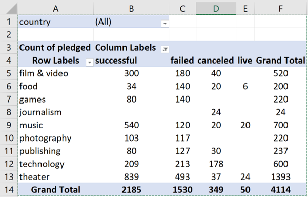
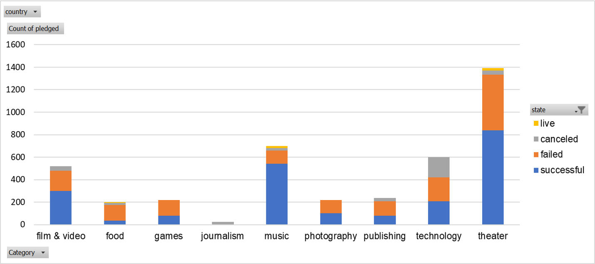
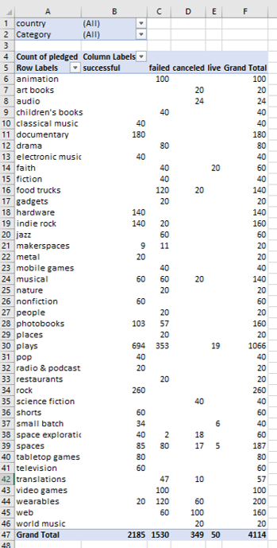
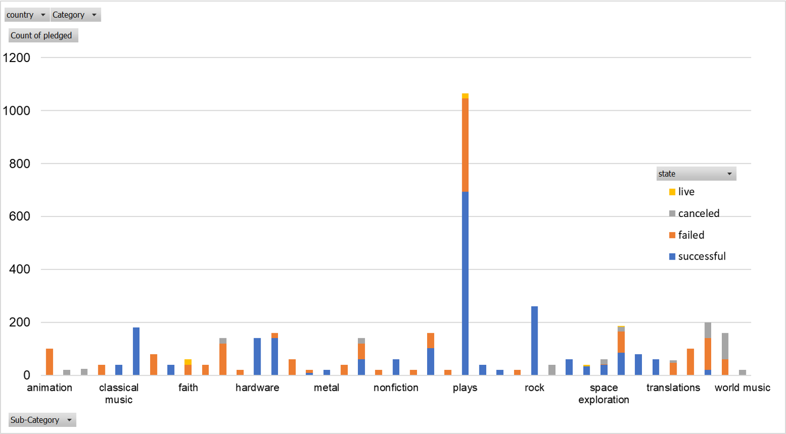
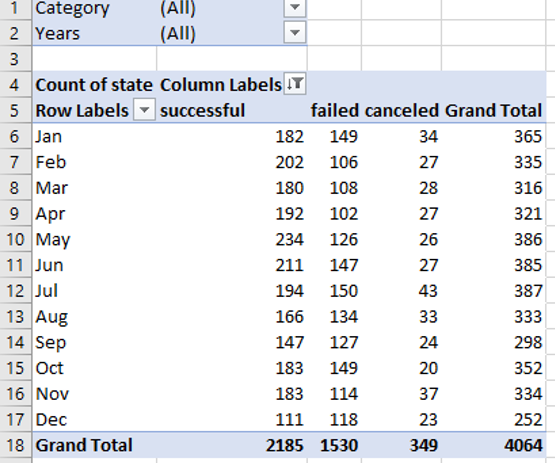
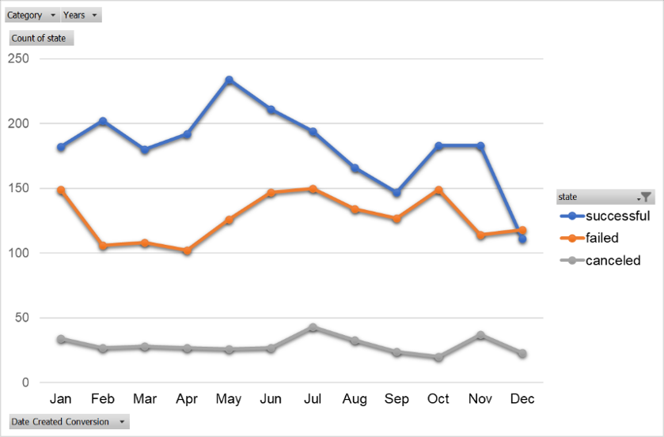
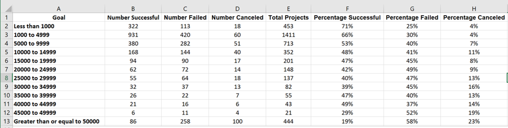
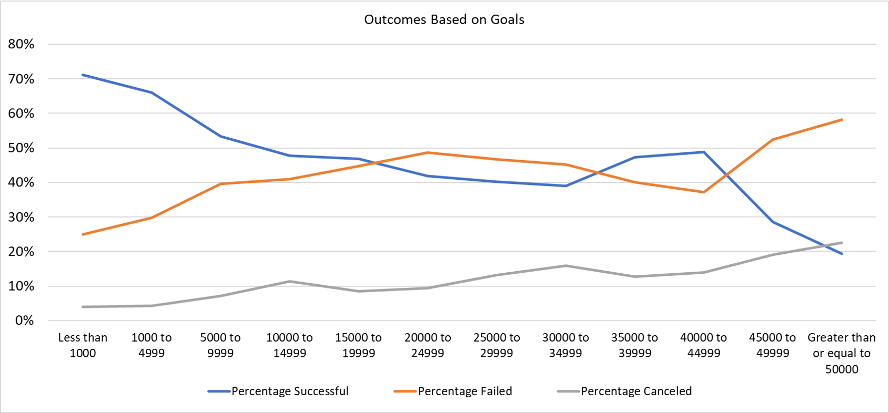
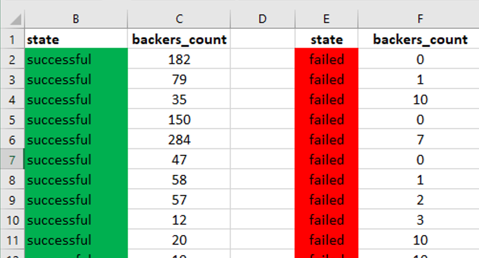
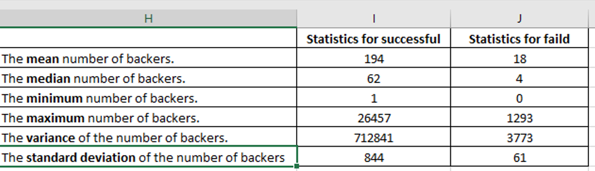

# **Success rate analysis of projects on Kickstarter in Excel**

Over $2 billion has been raised using the massively successful crowdfunding service, Kickstarter, but not every project has found success. Of the more than 300,000 projects launched on Kickstarter, only a third have made it through the funding process with a positive outcome.
In this project, the Kickstarter database (4,000 past projects) was analyzed.  Obtained results, allowed to uncover some hidden market trends, and help to determine the main features required to run the successful projects.

## **Input Data**

Calculations and analysis were performed using Microsoft Excel (Office 365) program (Microsoft Excel, https://office.microsoft.com/excel).

All data can be found in the Excel file: **01-Excel_Challenge.xlsx**  
This workbook has 6 sheets:  
* Table  
* PivotTable_1  
* PivotTable_2  
* PivotTable_3  
* Bonus  
* Bonus_Stat

The Kickstarter database can be found in the Table sheet. It contains the following data:  
* `name` – the name of the project  
* `blurb` – brief description of the project  
* `goal` – the required amount of money  
* `pledged` – obtained amount of money  
* `state` – the associated campaign was successful, failed, canceled, or live  
* `country` – country (US, GB, AU, etc.)  
* `currency` – the world currencies by countries  
* `deadline` – expected date when the project would be ended (in Unix timestamps)  
* `launched_at` – the date when the project was started (in Unix timestamps)  
* `backers_count` – the total amount of backers donated for the project  
* `Category and Sub-Category` – a type of industry project belongs (for example, food, music, games etc.)

## **Calculations and Formulas:**
 
Essential calculations and formatting were performed in the Table spreadsheet.

(1) Conditional formatting was used to fill each cell in the state column with a different color, depending on whether the associated campaign: successful (green), failed (red), canceled (yellow), or live (blue).

(2) A new `Percent Funded` (column O) was created. These data are used to uncover how much money a campaign made to reach its initial goal. Formula is:

`Percent Funded` = (`pledged` ∙ 100) / goal                                                                      

(3) Then, conditional formatting was used to fill each cell in the `Percent Funded` column using a three-color scale. The scale starts at 0 and became a dark shade of red, transitioning to green at 100, and blue at 200.

(4) A new column called `Average Donation` (column P) was created. These data are used to show how much each backer for the project paid on average. Formula is:

`Average Donation` =  `pledged` / `backers_count`                                                                

(5) The `Category and Sub-Category` (column N) was split into two parts: (i) `Category` (column Q), and (ii) `Sub-Category` (column R).   
Excel’s functions LEFT and RIGTH were used to do it. Example of used formulas for row #2 is presented below:

`Category` = LEFT(N2,FIND("\"/"\",N2)-1)                                                                       

`Sub-Category` = RIGHT(N2,LEN(N2)-FIND("\"/"\",N2))                                                                

(6) To determine the dates when the project was started and ended, the `deadline` and `launched_at columns` (with dates in Unix timestamps format) were converted it into an into Excel's date format using formulas:

`Date Created Conversion` = (((`launched_at`/60)/60)/24)+DATE(1970,1,1)                                           

`Date Ended Conversion` = (((`deadline`/60)/60)/24)+DATE(1970,1,1)                                                

Two new columns `Date Created Conversio` (column S) and `Date Ended Conversion` (column T) were created.

## **I. Data analysis**

### **PivotTable_1**

A new sheet with a pivot table (**PivotTable_1**) was created to analyze the initial worksheet and count how many campaigns were successful, failed, canceled, or live per Category (**Fig.1, PivotTable_1**). Additionally, a stacked column pivot chart that can be filtered by `country` has been produced (**Fig.2, PivotTable_1**).

  

 <em><b>Figure 1.</b> Pivot table: Filter = country; Rows = Category; Columns = state; Values = Count of pledged.</em>

  

  

 <em><b>Figure 2.</b> A stacked column pivot chart that can be filtered by country based on the table in PivotTable_1.</em>

  

### **PivotTable_2**

A new sheet with a pivot table (**PivotTable_2**) that will analyze the initial sheet to count how many campaigns were successful, failed, canceled, or live per Sub-Category (**Fig.3**). Additionally, a stacked column pivot chart that can be filtered by country based on the table has been produced (**Fig. 4, PivotTable_2**).
 
 

  

 <em><b>Figure 3.</b> Pivot table: Filter = country and Category; Rows = Sub-Category; Columns = state; Values = Count of pledged.</em>

  

  

 <em><b>Figure 4.</b> A stacked column pivot chart that can be filtered by country and Category based on the table in PivotTable_2.</em>

  

### **PivotTable_3**

A new sheet with a pivot table (**PivotTable_3**) was created with a column of state, rows of Date Created Conversion, values based on the count of state, and filters based on Category and Years (**Fig.5**). Also, a pivot chart line graph that visualizes this new table is presented on **Fig.6** (**PivotTable_3**). 

 

  

 <em><b>Figure 5.</b> Pivot table: Filter = Category and Years; Rows = Date Created Conversion; Columns = state; Values = Count of state.</em>

  

  

 <em><b>Figure 6.</b> Visualization of PivotTable_3.</em>

  

### **Conclusions**

* Journalism is a less successful and less profitable type of campaign.

* Obtained results showed that two of the most successful and profitable category of the projects are Theater and Music: Theater > Music 

* In the Theater-Category, the most successful division is Plays. In the case of the Music-Category, Rock music is the most fortunate. 

* The number of Cancelled projects does not have seasonal behavior: it is almost constant during the year. However, the number of successful projects is very sensitive to the season: it is increasing in the 1st half of the year (from January till June), but after June it is significantly decreasing till December.  

### **Limitations of this dataset**

*	The considered data set includes 4,000 past projects (from 300,000) only, which does not fully represent the population on Kickstarter campaigns. With a larger set, the ratio between successful and unsuccessful projects can be different.

*	To get the final conclusion about the most successful Category of projects, we need to compare Kickstarter results with data obtained from other crowdfunding platforms.

*	Additionally, it would be important to have data about the real profit of every project during the lifetime. Unfortunately, this dataset does not have this type of information. 

### **Other possible tables/graphs that could be created**

*	It will be very interesting to see the geographical distribution of successful and unsuccessful projects to see the preferences of different countries. To do this the pivot table: Filter = state, Rows = Category or Sub-Category, Columns = country, Values = Count of state. 

## **II. Bonus**

A new sheet (**Bonus**) was created. In this part I have calculated: (i) the amount of successful, failed, canceled, or live projects with respect to the goal within the ranges (**Fig.7, Bonus**); (ii) calculated the total number of projects per goal category; and (iii) determined the percentage of successful, failed, canceled, or live projects with respect to the goal (**Fig.7**).

To count how many successful, failed, and canceled projects were created with goals within the ranges the following function Using the `COUNTIFS()` were applied (example of formulas for successful projects):

`Number Successful` = COUNTIFS(Table!$D:$D,"<1000",Table!$F:$F,"successful")                                      

`Total Projects` = (`Number Successful` + `Number Failed` + `Number Canceled`)                                       

`Percentage Successful` =  (`Number Successful`)/(`Total Projects`) %                                               

  

 <em><b>Figure 7.</b> Number and percentage of successful, failed, canceled, or live projects with respect to the type of goal.</em>

  

  

 <em><b>Figure 8.</b> The relationship between a goal's amount and its chances at success, failure, or cancellation.</em>

 

### **Conclusion:**

These results showed, that curves of "Percentage Failed " projects and "Percentage successful" projects are an approximate mirror image of each other: both, the higher percentage of successful projects and the smallest percentage of the failed projects related to the smallest amount of requested money (goal), with increasing the goal the trend becomes opposite. 

## **III. Bonus Statistical Analysis**

In this part, the number of backers of successful and unsuccessful campaigns was evaluated by creating the summary statistics table (**Fig. 9** and **Fig.10**).
A new worksheet (**Bonus_Stat**) in the workbook was created. Then a column each for the number of backers of successful campaigns and unsuccessful campaigns was generated (**Fig.9**).

  

 <em><b>Figure 9.</b> The number of backers of successful campaigns and unsuccessful campaigns.</em>

These data were used to evaluate the following statistical data for successful campaigns, and then for unsuccessful campaigns (see **Fig.10**): 
*	The mean number of backers 
*	The median number of backers
*	The minimum number of backers.
*	The maximum number of backers.
*	The variance of the number of backers.
*	The standard deviation of the number of backers.
  

  

 <em><b>Figure 10.</b> The summary statistics table. </em>

 

### **Conclusions:** 
According to obtained statistical data, both data sets are very dispersed: a big difference between the minimum and maximum values. 
This affects the calculated data: 
* For both sets the median summarizes data more meaningfully to the relevant value. Additionally, The high values of variance allowed to conclude that the mean is not that useful.
* There is more variability with successful campaigns: the variance of the number of backers is 712841, which is in 189 times higher than for unsuccessful campaign. 
* Additional tests should be applied to the data sets to check which features don't add much value to the model and which are of importance.

