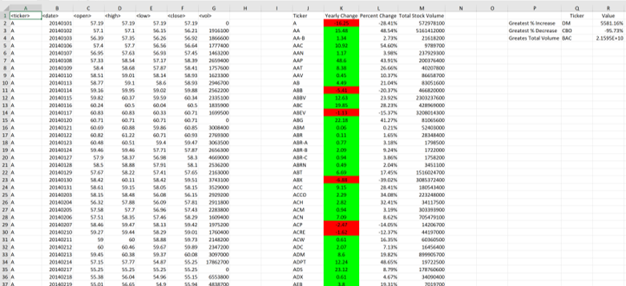
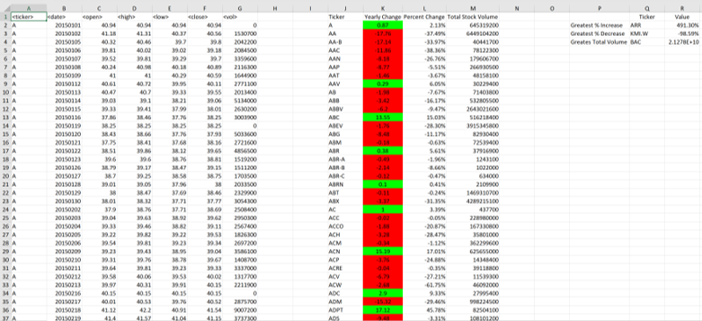
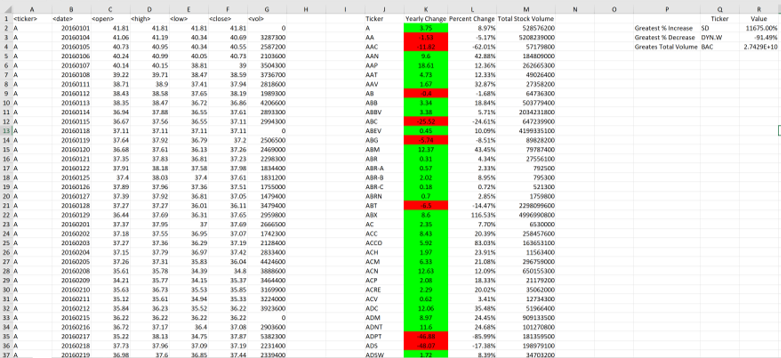

# **Project - The VBA of Wall Street**

This VBA scripting was used to analyze real stock market data.

## **Main Outlines of the VBA script**

[VBA script](vba_code.vb) - Use this file to see the VBA script.

* The final homework report was generated by using `Multiple_year_stock_data.xlsx` file.

* This VBA script will allow it to run on every worksheet, i.e., every year, just by running the VBA script once.

#### ** Part I. Tickers/Yearly Changes/Percent Change/Total Stock Volume:

  * `Ticker`: Every type of the ticker symbol is printed.

  * `Yearly Changes`: `the closing price at the end of that year` - `the opening price at the beginning of a given year` (for every ticker type).
  
  * `Total Stock Volume`: it the total sum of volume of the stock in currect year per ticker category.

  * `Percent Change`: `the closing price at the end of that year` / `the opening price at the beginning of a given year` (for every ticker type). Format - Percent.
  
      There was a problem with calculation of `Percent Change` for **PLNT** ticker type. The input table data of this ticker are equival to ZERO in the case of 2014. For 2015,
      only the data of the first half of the year are eqvivalent to ZERO. As a result: "The Erro Divition by 0".
  
      To avoid this problem approximations were applied:
  
      (1) If `Total Stock Volume` = 0, for this type of ticker the `Percent Change` became 0 as well.
  
      (2) If `Total Stock Volume` = 0 but the `closing price` OR `opening price` are NOT 0. In this case the script is lookong for the next/previous non-zero value in currecnt
          ticker category and then use it for the calculations of `Percent Change` and `Yearly Changes`.
  
  * Conditional Formatting was applied for` Year Change` column: positive change in green and negative change in red.
  
  #### ** Part II. Greatest % Increase / Greatest % Decrease / Greates Total Volume:
  
  In this part VBA script has loops to look for: 
  
 * `Greatest % Increase`: - Maximum value in the `Percent Change` column.
 
 * `Greatest % Decrease`: - Minimum value in the `Percent Change` column.
 
 * `Greates Total Volume`: - Maximum value in the `Total Stock Volume` column.
   
  
  ## **Results**

  

 <em><b>Figure 1.</b> Stock market data - 2014.</em>

  

  

 <em><b>Figure 2.</b> Stock market data - 2015.</em>

 

  

 <em><b>Figure 3.</b> Stock market data - 2016.</em>

 

