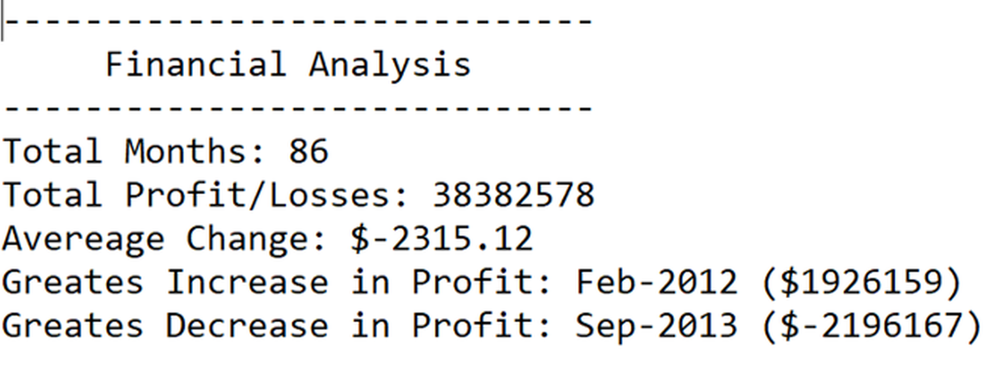

# **Python Challenge**

Two directories were created: `PyBank` and  `PyPoll`.

* Each folder inside has the following:

  * **main.py** - it is the main script to run for data analysis.
  * **analysis** - it is a folder that contains the text file that has the results from your analysis.

## PyBank

budget_data.csv - a set of financial data. 

### Input/output files:

Input file location: "Resources/budget_data.csv"

Output file location: "analysis/output.txt"

* The sctipt **main.py** analyzes the records to calculate each of the following:

  * The total number of months included in the dataset

  * The net total amount of `Profit/Losses` over the entire period

  * The average of the changes in `Profit/Losses` over the entire period

  * The greatest increase in profits (date and amount) over the entire period

  * The greatest decrease in losses (date and amount) over the entire period

* The final script print the analysis to the terminal and export a text file with the results.

  

## PyPoll

election_data.csv - - a set of data.

### Input/output files:

#Input file: "Resources/election_data.csv"

#Output file: "analysis/output.txt"

* The sctipt **main.py** analyzes the records to calculate each of the following:

  * The total number of votes cast

  * A complete list of candidates who received votes

  * The percentage of votes each candidate won

  * The total number of votes each candidate won

  * The winner of the election based on popular vote.

* The final script print the analysis to the terminal and export a text file with the results.

  

  
