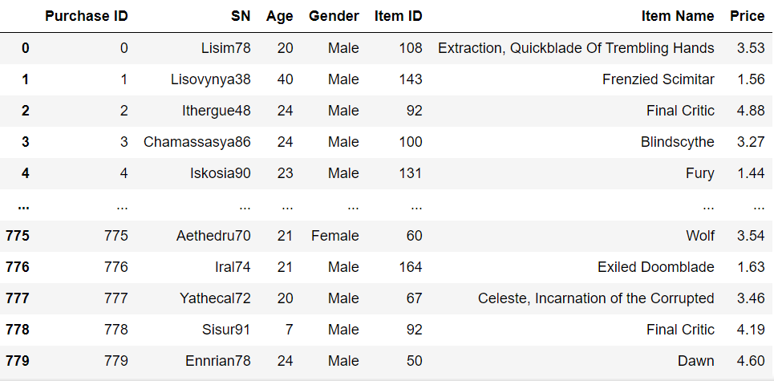
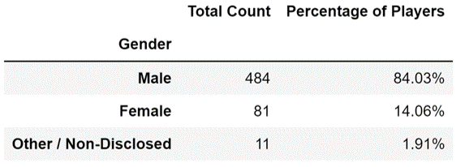

# **Pandas Challenge "Heroes Of Pymoli"**

For this assignment, I have completed `HeroesOfPymoli` Data Challenge.

Jupyter notebook was used to run the analysis. 

[Jupyter notebook file](HeroesOfPymoli_NVK.ipynb) - Use this script to see the following results.

## **Input Data**

Initial Data of "Heroes Of Pymoli" can be found in the [purchase_data.csv]("Resources/purchase_data.csv") file.

  

## **Report**

### I. Player Count

* Total Number of Players

  

---

### II. Purchasing Analysis (Total)

* Number of Unique Items
* Average Purchase Price
* Total Number of Purchases
* Total Revenue

  

---

### III. Gender Demographics

* Percentage and Count of Male Players
* Percentage and Count of Female Players
* Percentage and Count of Other / Non-Disclosed

  

---

### IV. Purchasing Analysis (Gender)

* The below each broken by gender
  * Purchase Count
  * Average Purchase Price
  * Total Purchase Value
  * Average Purchase Total per Person by Gender
  
  

    
  

---

### V. Age Demographics

* The below each broken into bins of 4 years (i.e. < 10, 10-14, 15-19, etc.)
  * Purchase Count
  * Average Purchase Price
  * Total Purchase Value
  * Average Purchase Total per Person by Age Group
  
   

    
  

---

### VI. Top Spenders

* Identify the the top 5 spenders in the game by total purchase value, then list (in a table):
  * SN
  * Purchase Count
  * Average Purchase Price
  * Total Purchase Value

  

    
  

 ---

### VII. Most Popular Items

* Identify the 5 most popular items by purchase count, then list (in a table):
  * Item ID
  * Item Name
  * Purchase Count
  * Item Price
  * Total Purchase Value
  
  

    
  

---

### VIII. Most Profitable Items

* Identify the 5 most profitable items by total purchase value, then list (in a table):
  * Item ID
  * Item Name
  * Purchase Count
  * Item Price
  * Total Purchase Value
  
  

    
  

---

As final considerations:

* You must use the Pandas Library and the Jupyter Notebook.
* You must submit a link to your Jupyter Notebook with the viewable Data Frames.
* You must include a written description of three observable trends based on the data.
* See [Example Solution](HeroesOfPymoli/HeroesOfPymoli_starter.ipynb) for a reference on expected format.

