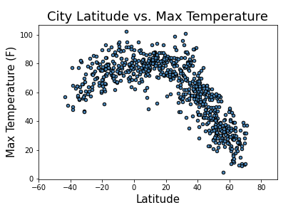

# **Python API Homework - What's the Weather Like?**

## **Input Data**

To run these scripts yo will need:

* Install `citypy` in your python environment (https://pypi.python.org/pypi/citipy)

* Create two API Keys and store them in the 'api_keys.py':

    `weather_api_key` - OpenWeatherMap API Key (https://openweathermap.org/)
    
    `g_key` - Google API Key (https://console.developers.google.com/getting-started) 
    
## **Part I - WeatherPy**

In this part, a Python script to visualize the weather of 500+ cities across the world of varying distance from the equator was created. 

`WeatherPy/WeatherPy_solved.ipynb` - script to run the analysis (Jupyter Notebook)

In the first step, a series of scatter plots to showcase the following relationships were created:

* Temperature (F) vs. Latitude

Humidity (%) vs. Latitude
Cloudiness (%) vs. Latitude
Wind Speed (mph) vs. Latitude

## **Part II - VacationPy**
