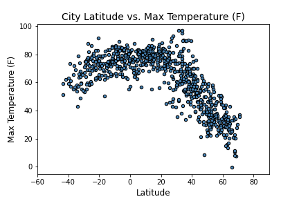
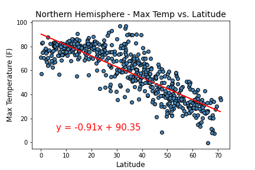
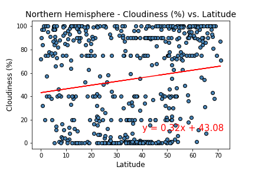
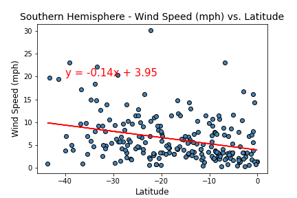

# **Python API Homework - What's the Weather Like?**

## **Input Data**

`WeatherPy/WeatherPy_solved.ipynb` - script to run the weather analysis (Jupyter Notebook)

`VacationPy/VacationPy_solved.ipynb` - script to run the vacation analysis (Jupyter Notebook)

To run these scripts you will need:

* Install `citypy` in your python environment (https://pypi.python.org/pypi/citipy)

* Create two API Keys and store them in the 'api_keys.py':

    `weather_api_key` - OpenWeatherMap API Key (https://openweathermap.org/)
    
    `g_key` - Google API Key (https://console.developers.google.com/getting-started) 
    
## **Part I - WeatherPy**

In this part, a Python script to visualize the weather of 500+ cities across the world of varying distance from the equator was created. 

In the first step, a series of scatter plots to showcase the following relationships were created:

The second step is to run linear regression on each relationship. This time, cities were separating into Northern Hemisphere (greater than or equal to 0 degrees latitude) and Southern Hemisphere (less than 0 degrees latitude):

#### 1. Northern Hemisphere - Temperature (F) vs. Latitude

The value of (R2) is 0.6928352119310256

#### 2. Southern Hemisphere - Temperature (F) vs. Latitude

The value of (R2) is 0.29777248084213165

#### 3. Northern Hemisphere - Humidity (%) vs. Latitude

The value of (R2) is 0.036520078332717434

#### 4. Southern Hemisphere - Humidity (%) vs. Latitude

The value of (R2) is 0.06510856728144215

#### 5. Northern Hemisphere - Cloudiness (%) vs. Latitude

The value of (R2) is 0.02222779724000044

#### 6. Southern Hemisphere - Cloudiness (%) vs. Latitude

The value of (R2) is 0.015428689903624284

#### 7. Northern Hemisphere - Wind Speed (mph) vs. Latitude

The value of (R2) is 0.00022051436367263692

#### 8. Southern Hemisphere - Wind Speed (mph) vs. Latitude

The value of (R2) is 0.09267616215139951

### Conclutions - Part I.

* Highest temperature is found for cities with latitudes between 20 and -20. Temperature significantly drops with increasing the latitude.

* Cities from the Northern Hemisphere have lower humidity with respect to the cities from the Southern Hemisphere.

* Wind Speed (mph) data for all latitutes are mainly concentrate in the   

## **Part II - VacationPy**

Now obtained weather data can be used to plan future vacations. Jupyter-gmaps and the Google Places API were used for this part of the project.

* Heat map that displays the humidity for every city from the part I of the project was generated.

  

- Narrow down the DataFrame to find my ideal weather condition. For example:

  - A max temperature lower than 80 degrees but higher than 70.
  - Wind speed less than 10 mph.
  - Zero cloudiness.
  - Drop any rows that don't contain all three conditions.

