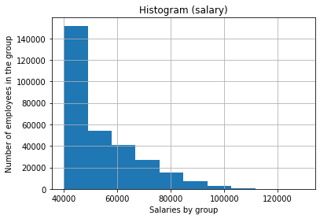

# **Employee Database: A Mystery in Two Parts**

In this research project, we are focused on employees of the corporation (Pewlett Hackard) from the 1980s and 1990s. All that remain of the database of employees from that period are six CSV files:

* departments.csv
* dept_emp.csv
* dept_manager.csv
* employees.csv
* salaries.csv
* titles.csv

We will design the tables to hold data in the CSVs, import the CSVs into a SQL database, and answer questions about the data:

1. Data Engineering

2. Data Analysis

## Data Modeling

Inspect the CSVs and sketch out an ERD of the tables.

QuickDBD tool was used to scetch EDR [http://www.quickdatabasediagrams.com](http://www.quickdatabasediagrams.com).

Data types, primary keys, foreign keys, and other constraints were specified:

The SQL sctipt for ERD schema can be found here: [EDR_schemata.sql](EDR_schemata.sql) 

## Data Engineering and Analysis

[Data_Modeling.sql](Data_Modeling.sql) script was used for this part.

Each CSV file was imported into into the corresponding SQL table.

After the database was completed the following procedures were performed:

1. List the following details of each employee: employee number, last name, first name, sex, and salary.

2. List first name, last name, and hire date for employees who were hired in 1986.

3. List the manager of each department with the following information: department number, department name, the manager's employee number, last name, first name.

4. List the department of each employee with the following information: employee number, last name, first name, and department name.

5. List first name, last name, and sex for employees whose first name is "Hercules" and last names begin with "B."

6. List all employees in the Sales department, including their employee number, last name, first name, and department name.

7. List all employees in the Sales and Development departments, including their employee number, last name, first name, and department name.

8. In descending order, list the frequency count of employee last names, i.e., how many employees share each last name.

## SQL database and Pandas (Bonus)

1. SQL database was import into Pandas using sqlalchemy method.

2. Create a histogram to visualize the most common salary ranges for employees was generated.

 

3. A bar chart of average salary by title was created.

