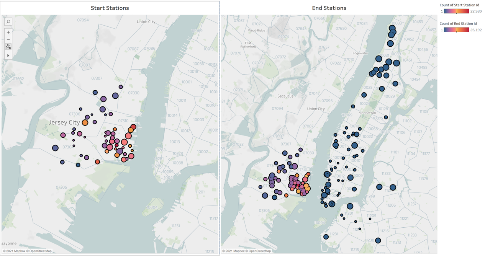
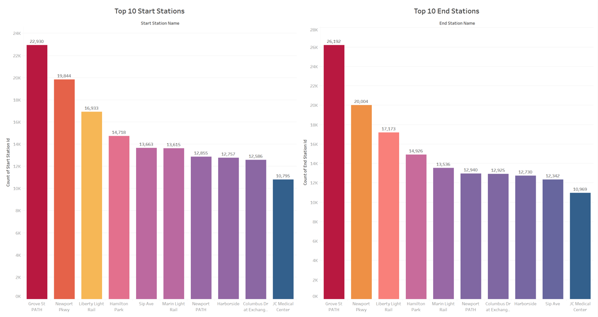
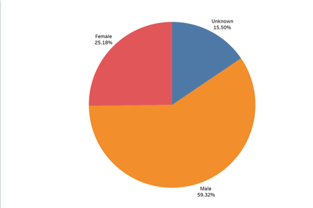
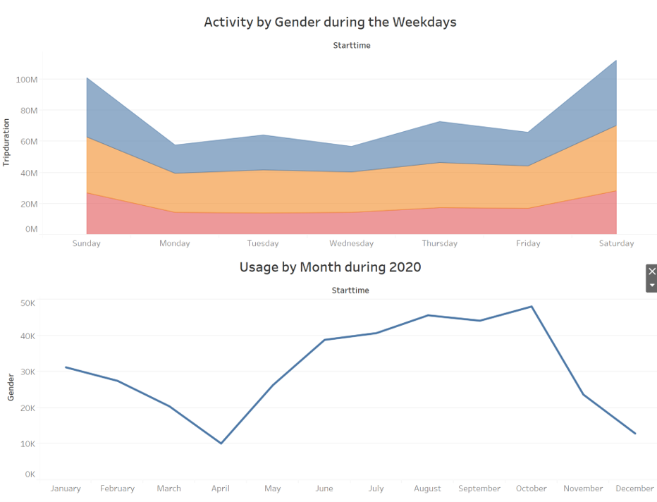
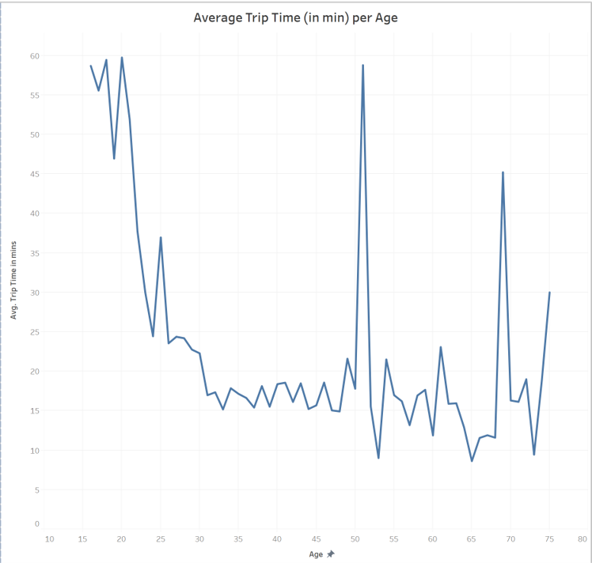
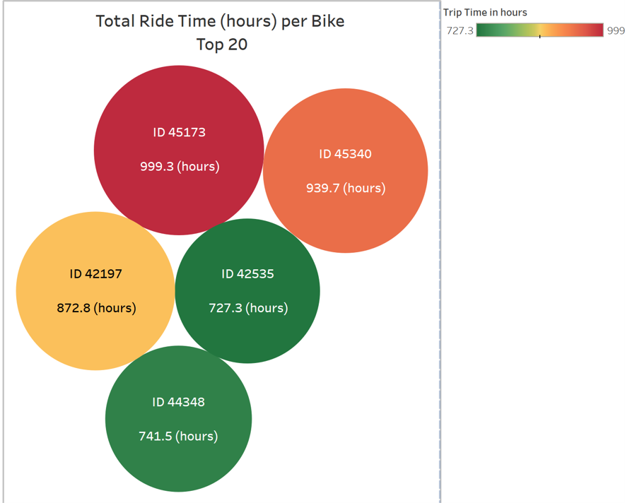

# Tableau - Citi Bike Analytics (2020)

### Before You Begin

* This assignment will be saved to your Tableau Public account rather than GitHub. 

* If you haven't already, be sure to create a Tableau Public account [here](https://public.tableau.com/s/).

* The free tier of Tableau only lets you save to their public server. This means that each time you save your file it will be uploaded to your Tableau Public profile. 

* You are able to load and continue working on the same workbook.

* When you are finished with your assignment, you will turn in the URL to your Tableau Public workbook along with any additional files used for your analysis. 

## Background

Congratulations on your new job! As the new lead analyst for the [New York Citi Bike](https://en.wikipedia.org/wiki/Citi_Bike) Program, you are now responsible for overseeing the largest bike sharing program in the United States. In your new role, you will be expected to generate regular reports for city officials looking to publicize and improve the city program.

Since 2013, the Citi Bike Program has implemented a robust infrastructure for collecting data on the program's utilization. Through the team's efforts, each month bike data is collected, organized, and made public on the [Citi Bike Data](https://www.citibikenyc.com/system-data) webpage.

However, while the data has been regularly updated, the team has yet to implement a dashboard or sophisticated reporting process. City officials have a number of questions on the program, so your first task on the job is to build a set of data reports to provide the answers.

## Task

## Submission 

The final submission includes:

1. Jupyter Notebook file with collecting and cleaning data [link](https://github.com/karimova/UCI_HW_Karimova/blob/master/17-Tableau-Challenge/data_enginiring_cleaning.ipynb)

2. A link to your Tableau Public workbook that includes [link](https://github.com/karimova/UCI_HW_Karimova/blob/master/17-Tableau-Challenge/HW_Karimova_all.twbx): 
  * 15 Total Visualizations (Worksheets) 
  * 6 Dashboards
  * 1 City Official Map
  * 1 Story 

## Results

1. ### Map visualization for city officials.

People prefer to travel from Jersey City to Manhattan by bike. We can see that all start stations are concentrated in Jersey. However, the the returning stations are located in both cities: Jersey and New York.

2. ### The most popular stations to start and to end the ride

Two the most popular stations to start and end the ris are: Grove St. Path and Newport Pkwy.

3. ### Gender Distributions

Gender distribution analysis shows that men use the CityBike more actevly (59%) with respect to the woman (25%). 
Note: There were 15% users did not provide gender information.

4. ### Ride activity by gender

The most popular days to ride are Saturday and Sunday.

During the 2020 the maximum trips was obsirved between May and November. April has a very strong deep that may be realted to the COVID lockdown in spring time. December minimum can be asing with cold weather during the winter time.

5. ### Average Trip time (min) by Age

The longest rides observed for age benween: 

(i) 15 and 25 years old,

(ii) 50 and 52 years old.

6. ### Total amount of hours each bike were used (top 5 exstensivley used bikes)

The mostly used bike is #45173. It was used for 999 hours total.

